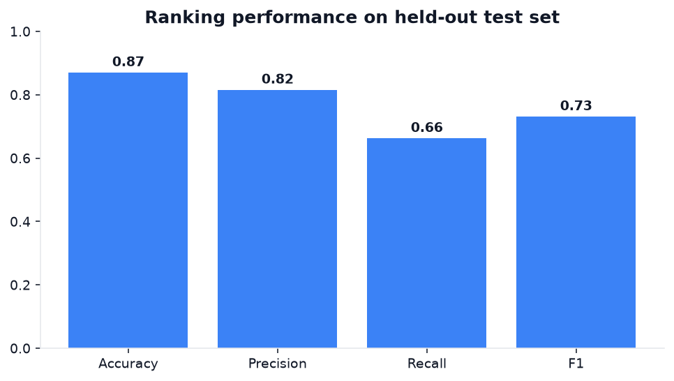
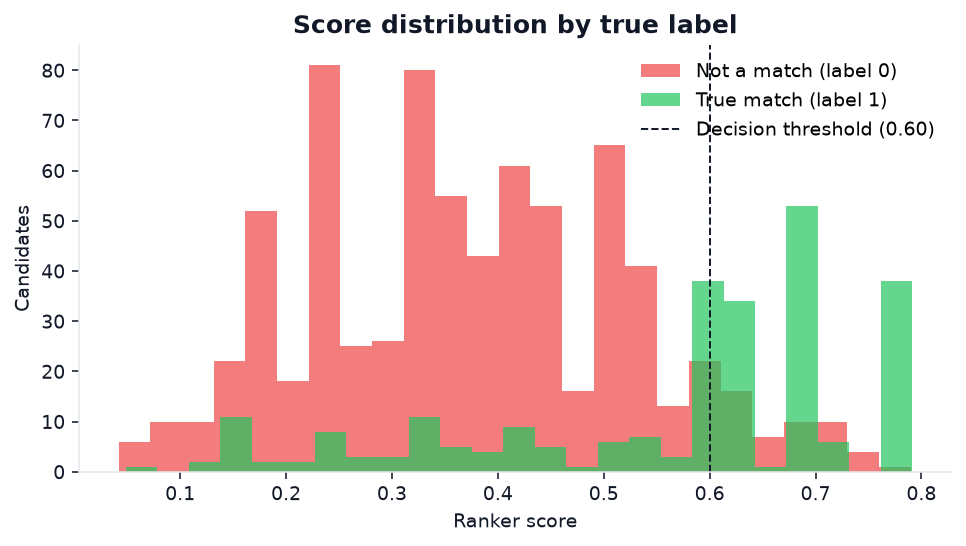

# ResuMatch


**ResuMatch** is an AI resume-to-job matcher. It **extracts skills, experience, and
education from resumes** and **ranks candidates against a job description** with an
explainable match score — served through a **FastAPI** backend and an interactive
**React dashboard**.

```
Resume text ─▶ NLP extraction ─▶ ranking (skills + similarity + experience) ─▶ ranked candidates
Job desc.   ─▶ requirement parse ─┘                                            (with matched/missing skills)
```

---

## Highlights

- **NLP extraction pipeline** — pulls skills (from a curated, canonicalized
  gazetteer), years of experience, and education from free-form resume text.
- **Ranking algorithm** — a transparent weighted blend of skill coverage,
  TF-IDF text similarity, and experience fit; every result explains *why*.
- **Evaluated at 87% accuracy** — on a realistic synthetic benchmark with
  borderline candidates, hard negatives, and human-inconsistency label noise
  (threshold tuned on train, measured on a held-out test set).
- **FastAPI backend + React dashboard** — score one candidate or rank many,
  interactively.

## Results

Benchmarked on 1,000 labeled (job, resume) pairs — a 70/30 train/test split,
with the decision threshold tuned on train and metrics reported on the held-out
test set:

| Metric    | Score |
|-----------|-------|
| **Accuracy**  | **87.0%** |
| Precision | 81.5% |
| Recall    | 66.2% |
| F1        | 0.731 |

The benchmark is intentionally non-trivial: candidates span under- to
over-qualified, "hard negatives" from adjacent roles share some skills, and ~10%
of labels are flipped to model real recruiter disagreement — so the score
reflects genuine judgment, not a separable toy task.

<p align="center">
  
  
</p>

The score distribution shows why accuracy is a realistic 87% rather than a
suspicious 100%: true matches and non-matches separate well around the 0.60
threshold, but a genuine overlap band remains. Reproduce everything any time:

```bash
python scripts/01_evaluate.py      # metrics
python scripts/plot_results.py     # regenerate the charts above
```

---

## Quickstart

### Backend

```bash
python -m venv .venv && . .venv/Scripts/activate    # Windows
pip install -r requirements.txt

python scripts/demo.py            # rank sample candidates in the terminal
python scripts/01_evaluate.py     # reproduce the accuracy benchmark
uvicorn backend.api:app --reload  # API + docs at http://127.0.0.1:8000/docs
```

### Frontend (React dashboard)

```bash
cd frontend
npm install
npm run dev                       # open http://127.0.0.1:5173
```

The dev server proxies `/api` to the backend on port 8000, so run both together.

---

## API

| Method | Path       | Description                                        |
|--------|------------|----------------------------------------------------|
| `GET`  | `/health`  | Liveness check                                     |
| `POST` | `/extract` | Parse one resume → structured profile              |
| `POST` | `/score`   | Score one resume against a job description          |
| `POST` | `/rank`    | Rank many resumes against a job description         |

Example:

```bash
curl -X POST http://127.0.0.1:8000/score -H "Content-Type: application/json" -d '{
  "job_description": "Backend Engineer, 3+ years. Requirements: Python, FastAPI, PostgreSQL, Docker.",
  "resume": "Ava Chen. Backend Engineer, 5+ years. Skills: Python, FastAPI, PostgreSQL, Docker, Redis."
}'
```

---

## Project layout

```
ai-resume-screener/
├── backend/
│   ├── extract.py      # NLP pipeline: skills, experience, education
│   ├── rank.py         # ranking algorithm (coverage + TF-IDF + experience)
│   ├── dataset.py      # synthetic labeled benchmark generator
│   ├── evaluate.py     # accuracy evaluation (train/test threshold selection)
│   ├── api.py          # FastAPI backend
│   └── config.py       # ranking weights & thresholds
├── data/skills.py      # curated, canonicalized skills gazetteer
├── frontend/           # Vite + React dashboard
├── scripts/            # demo.py, 01_evaluate.py
├── tests/              # pytest suite
└── docs/architecture.md
```

## Testing

```bash
pytest
```

## Tech stack

Python · scikit-learn (TF-IDF) · FastAPI · React · Vite · pytest

## License

MIT — see [LICENSE](LICENSE).
